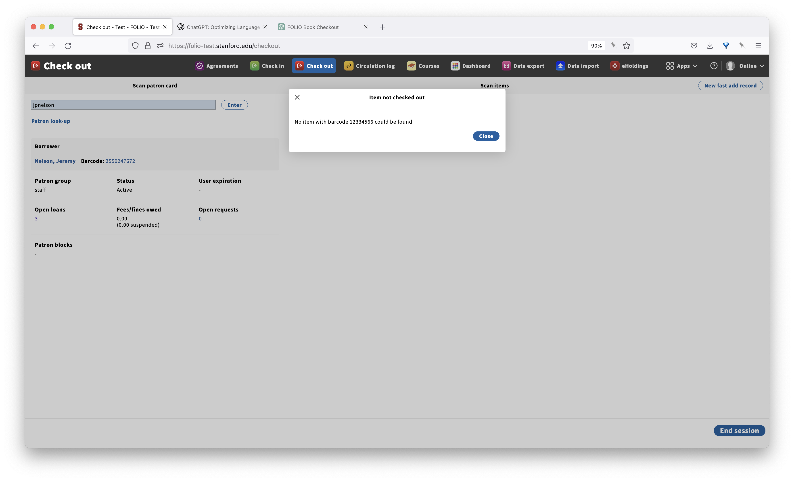
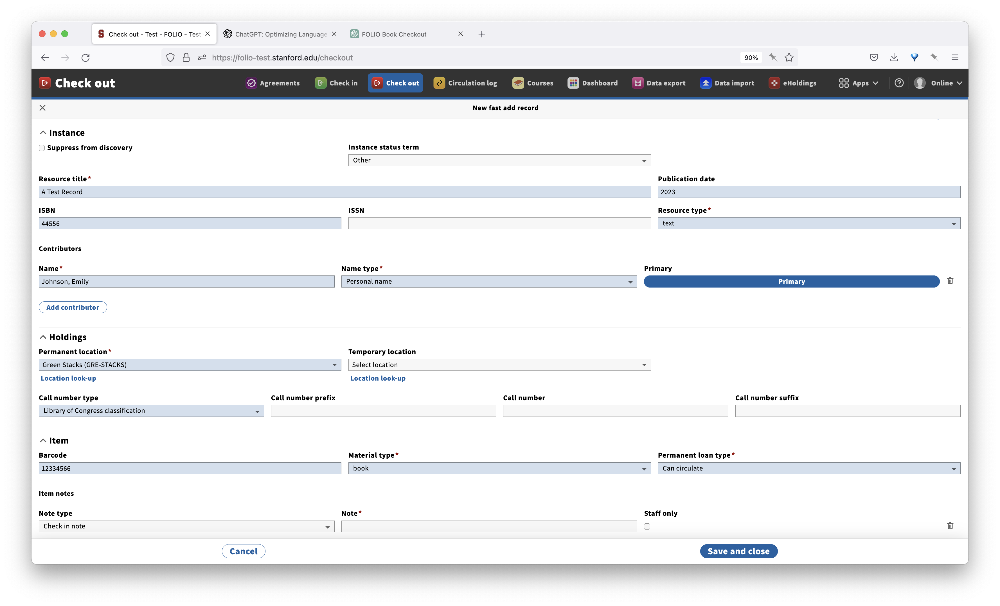

# FOLIO ML Use Case - Checkout Fast Add Record
1. Patron approaches circulation desk to check-out a monograph
1. Staff member searches and retrieves patron information from the user's ID

1. Staff member scans barcode from book into FOLIO and clicks enter
1. FOLIO Returns message that **Item not checked out** that item with that barcode could not be found

1. Staff member exits dialog and then clicks on the **New fast add record**
1. Staff uploads a photo of the book cover, a visual machine learning model pre-fills the quick add form based on extracted information

1. Staff adjusts a couple of the fields based on the copy-in-hand and clicks the **Save and close** button.
1. FOLIO updates the item status, loans the book to the patron, and the staff member prints a receipt
1. Patron leaves with the book